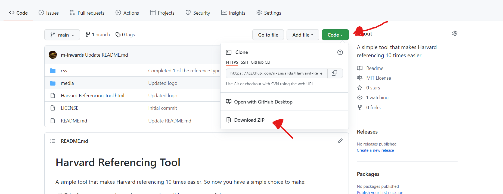

# Harvard Referencing Tool
A simple tool that makes Harvard referencing 10 times easier. So now you have a simple choice to make:

- [ ] Take forever to complete references and possibly mess some of them up

OR

- [x] Use this app and save your time

## Installation
To install, simply download the GitHub repo, unzip and run "Harvard Referencing Tool.html" in a browser.

#### Reference Image (How to download)

The system has been tested in google chrome, but should have no foreseen issues in any other mainstream browser.

## Note To Programmers
I am aware there are better ways of structuring the code here into separate files etc. This would make the JavaScript much easier to manage and develop moving forward. The reason that it is all on the one page is because I wanted this to be something that everyone can just download and run without having to setup anything else extra.

## License
MIT License

Copyright (c) 2022 Matt

Permission is hereby granted, free of charge, to any person obtaining a copy of this software and associated documentation files (the "Software"), to deal in the Software without restriction, including without limitation the rights to use, copy, modify, merge, publish, distribute, sublicense, and/or sell copies of the Software, and to permit persons to whom the Software is furnished to do so, subject to the following conditions:

The above copyright notice and this permission notice shall be included in all copies or substantial portions of the Software.

THE SOFTWARE IS PROVIDED "AS IS", WITHOUT WARRANTY OF ANY KIND, EXPRESS OR IMPLIED, INCLUDING BUT NOT LIMITED TO THE WARRANTIES OF MERCHANTABILITY, FITNESS FOR A PARTICULAR PURPOSE AND NONINFRINGEMENT. IN NO EVENT SHALL THE AUTHORS OR COPYRIGHT HOLDERS BE LIABLE FOR ANY CLAIM, DAMAGES OR OTHER LIABILITY, WHETHER IN AN ACTION OF CONTRACT, TORT OR OTHERWISE, ARISING FROM, OUT OF OR IN CONNECTION WITH THE SOFTWARE OR THE USE OR OTHER DEALINGS IN THE SOFTWARE.
